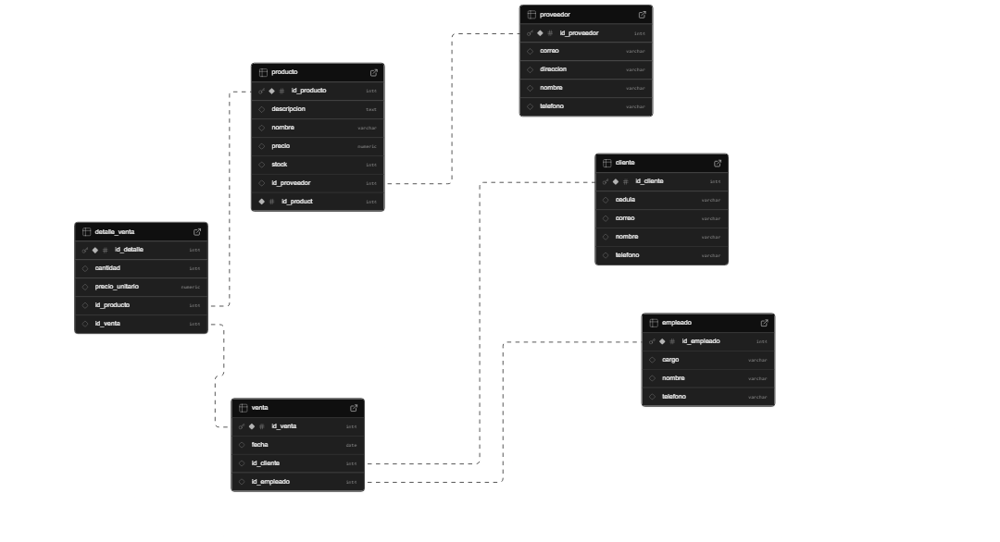

# Papelería CRUD Spring Boot + PostgreSQL

Este proyecto implementa una aplicación CRUD utilizando Spring Boot y PostgreSQL, con uso de consultas nativas y una arquitectura basada en servicios y controladores.

---

## Servicios y Controladores

A continuación, se detallan los servicios disponibles en el sistema, organizados por entidad, incluyendo el nombre del controlador que los gestiona y el nombre del servicio asociado.

### Ventas

- **Controlador:** `VentaController`
- **Servicio:** `VentaService`

| Método HTTP | Ruta                    | Descripción             | Método en el controlador     |
| ----------- | ----------------------- | ----------------------- | ---------------------------- |
| `GET`       | `/ventas/listar`        | Listar todas las ventas | `listarVentas()`             |
| `GET`       | `/ventas/{id}`          | Buscar venta por ID     | `obtenerVentaPorId(Long id)` |
| `POST`      | `/ventas/guardar`       | Guardar nueva venta     | `guardarVenta(Venta v)`      |
| `PUT`       | `/ventas/actualizar`    | Actualizar venta        | `actualizarVenta(Venta v)`   |
| `DELETE`    | `/ventas/eliminar/{id}` | Eliminar venta por ID   | `eliminarVenta(Long id)`     |

### Clientes

- **Controlador:** `ClienteController`
- **Servicio:** `ClienteService`

| Método HTTP | Ruta                      | Descripción               | Método en el controlador       |
| ----------- | ------------------------- | ------------------------- | ------------------------------ |
| `GET`       | `/clientes/listar`        | Listar todos los clientes | `listarClientes()`             |
| `GET`       | `/clientes/{id}`          | Buscar cliente por ID     | `obtenerClientePorId(Long id)` |
| `POST`      | `/clientes/guardar`       | Guardar nuevo cliente     | `guardarCliente(Cliente c)`    |
| `PUT`       | `/clientes/actualizar`    | Actualizar cliente        | `actualizarCliente(Cliente c)` |
| `DELETE`    | `/clientes/eliminar/{id}` | Eliminar cliente por ID   | `eliminarCliente(Long id)`     |

### Productos

- **Controlador:** `ProductoController`
- **Servicio:** `ProductoService`

| Método HTTP | Ruta                       | Descripción              | Método en el controlador         |
| ----------- | -------------------------- | ------------------------ | -------------------------------- |
| `GET`       | `/productos/listar`        | Listar productos         | `listarProductos()`              |
| `GET`       | `/productos/{id}`          | Buscar producto por ID   | `obtenerProductoPorId(Long id)`  |
| `POST`      | `/productos/guardar`       | Guardar producto         | `guardarProducto(Producto p)`    |
| `PUT`       | `/productos/actualizar`    | Actualizar producto      | `actualizarProducto(Producto p)` |
| `DELETE`    | `/productos/eliminar/{id}` | Eliminar producto por ID | `eliminarProducto(Long id)`      |

### Empleados

- **Controlador:** `EmpleadoController`
- **Servicio:** `EmpleadoService`

| Método HTTP | Ruta                       | Descripción              | Método en el controlador         |
| ----------- | -------------------------- | ------------------------ | -------------------------------- |
| `GET`       | `/empleados/listar`        | Listar empleados         | `listarEmpleados()`              |
| `GET`       | `/empleados/{id}`          | Buscar empleado por ID   | `obtenerEmpleadoPorId(Long id)`  |
| `POST`      | `/empleados/guardar`       | Guardar empleado         | `guardarEmpleado(Empleado e)`    |
| `PUT`       | `/empleados/actualizar`    | Actualizar empleado      | `actualizarEmpleado(Empleado e)` |
| `DELETE`    | `/empleados/eliminar/{id}` | Eliminar empleado por ID | `eliminarEmpleado(Long id)`      |

### Proveedores

- **Controlador:** `ProveedorController`
- **Servicio:** `ProveedorService`

| Método HTTP | Ruta                         | Descripción               | Método en el controlador           |
| ----------- | ---------------------------- | ------------------------- | ---------------------------------- |
| `GET`       | `/proveedores/listar`        | Listar proveedores        | `listarProveedores()`              |
| `GET`       | `/proveedores/{id}`          | Buscar proveedor por ID   | `obtenerProveedorPorId(Long id)`   |
| `POST`      | `/proveedores/guardar`       | Guardar proveedor         | `guardarProveedor(Proveedor p)`    |
| `PUT`       | `/proveedores/actualizar`    | Actualizar proveedor      | `actualizarProveedor(Proveedor p)` |
| `DELETE`    | `/proveedores/eliminar/{id}` | Eliminar proveedor por ID | `eliminarProveedor(Long id)`       |

### Detalle de Venta

- **Controlador:** `DetalleVentaController`
- **Servicio:** `DetalleVentaService`

| Método HTTP | Ruta                            | Descripción              | Método en el controlador             |
| ----------- | ------------------------------- | ------------------------ | ------------------------------------ |
| `GET`       | `/detalle-ventas/listar`        | Listar detalles de venta | `listarDetalleVentas()`              |
| `GET`       | `/detalle-ventas/{id}`          | Buscar detalle por ID    | `obtenerDetallePorId(Long id)`       |
| `POST`      | `/detalle-ventas/guardar`       | Guardar detalle          | `guardarDetalle(DetalleVenta dv)`    |
| `PUT`       | `/detalle-ventas/actualizar`    | Actualizar detalle       | `actualizarDetalle(DetalleVenta dv)` |
| `DELETE`    | `/detalle-ventas/eliminar/{id}` | Eliminar detalle         | `eliminarDetalle(Long id)`           |

---

## Consultas Nativas

A continuación se documentan las consultas nativas utilizadas, incluyendo la sentencia SQL y la lógica de construcción de cada una.

### Consulta: Listar productos con stock menor a 10

```sql
SELECT * FROM productos WHERE stock < 10;
```

**Lógica:** Permite identificar productos que necesitan reposición.

### Consulta: Ventas realizadas por un cliente específico

```sql
SELECT * FROM ventas WHERE cliente_id = ?;
```

**Lógica:** Permite obtener el historial de compras por cliente. El parámetro `?` es reemplazado por el ID del cliente.

### Consulta: Empleados por cargo específico

```sql
SELECT * FROM empleados WHERE cargo = ?;
```

**Lógica:** Filtra empleados por su cargo actual. Útil para asignaciones de tareas o análisis.

### Consulta: Productos de un proveedor específico

```sql
SELECT * FROM productos WHERE proveedor_id = ?;
```

**Lógica:** Ayuda a ver qué productos ofrece un proveedor determinado.

### Consulta: Total de ventas por día

```sql
SELECT fecha, SUM(total) FROM ventas GROUP BY fecha;
```

**Lógica:** Suma el total vendido por cada día, útil para análisis financieros.

---

## Modelo de Supabase 
```

```

## Estructura de Paquetes
```
src/
├── controller/       → Controladores REST
├── service/          → Lógica de negocio
├── repository/       → Interfaces JpaRepository con consultas nativas
├── model/            → Entidades JPA
```

---

